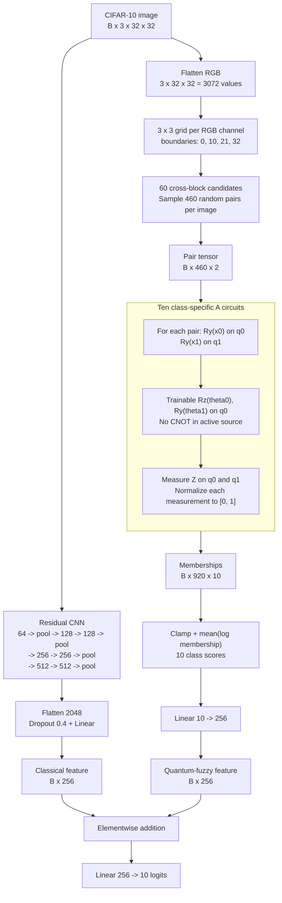
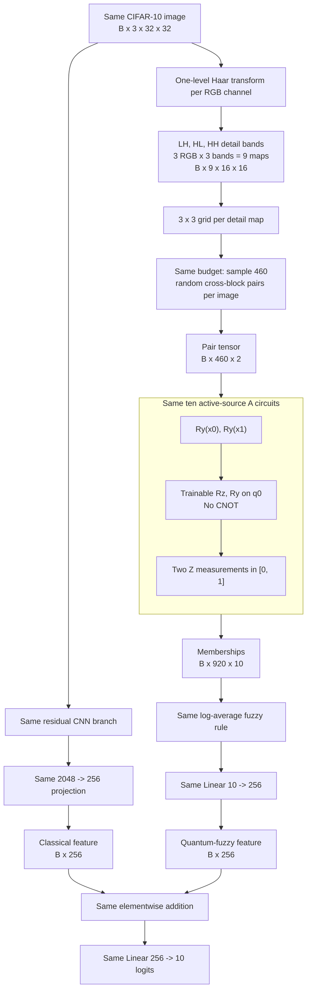
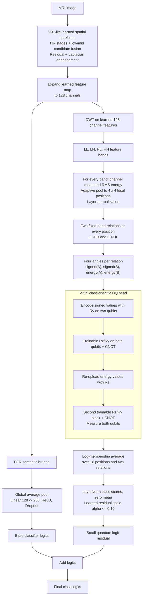
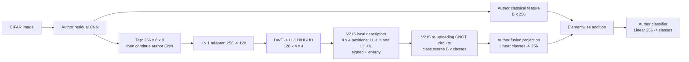
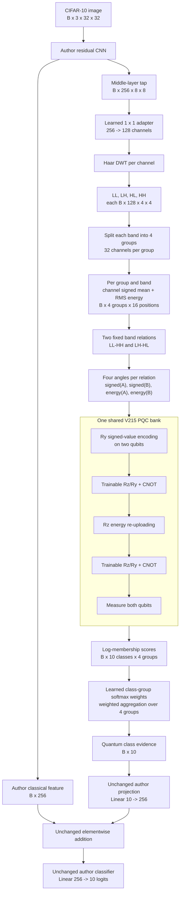

# CIFAR-10 Model Flows

The two experiments share the CNN branch, fusion head, optimizer, pair budget,
and active-source A circuit. The only experimental change is the input supplied
to the quantum-fuzzy branch.

## Author Active CIFAR Source A



## Current Haar Input Experiment (Not V215)



## Controlled Difference

| Component | Author source A | Our variant |
| --- | --- | --- |
| Quantum input | Raw normalized RGB pixel pairs | Haar LH/HL/HH detail-coefficient pairs |
| Quantum feature maps | 3 maps at 32 x 32 | 9 maps at 16 x 16 |
| Pair count | 460 | 460 |
| Circuit | Active-source A, no CNOT | Identical |
| CNN, fusion, classifier, optimizer | Identical | Identical |

The Haar comparison therefore tests whether replacing raw local values with
local directional high-frequency detail improves this exact source model. It
is a simple input substitution, not the V215 strategy.

## Actual V215 Strategy Used in the Brain-Tumor Project



V215 differs materially from the current CIFAR Haar experiment: it applies DWT
after a learned feature extractor, uses two fixed frequency relations across a
4 x 4 grid, re-uploads signed and energy descriptors, has two entangling
two-qubit blocks, and adds a bounded residual directly to the base logits.

## V215 Local Strategy With Author Feature Fusion



This is the implemented `v215_local` source. It intentionally omits V215's
`alpha * quantum_logits` classifier-logit residual. The fusion operation is
the author model's feature-level addition instead.

## Proposed V216 Group-Preserving Local Quantum Head



V216 changes only the descriptor path from one all-channel statistic to four
group-preserving statistics. The learned adapter can organize related channels
before the fixed split. All groups share the existing class-specific V215 PQC
parameters; the circuit depth, measurements, feature-level fusion, classifier,
and training protocol remain unchanged. This isolates whether preserving
channel-group information improves the quantum branch.

## V217 Cross-Band Relative Energy

V217 keeps the complete V216 architecture and changes only the energy
descriptor. V216 independently applies spatial `LayerNorm` to each band's 16
energy values. V217 instead computes, for every sample, channel group, and
local position:

```text
r_b = log(E_b + eps) - mean_k(log(E_k + eps)), k in {LL, LH, HL, HH}
```

The four relative-energy values sum to zero and are invariant to a common
feature-amplitude scaling. Signed descriptors retain V216's spatial
normalization. The shared PQC bank, LL-HH/LH-HL relations, class-group pooling,
author projection, feature addition, classifier, and training protocol are
unchanged. This controlled experiment tests whether explicit cross-band energy
contrast is useful to the quantum branch.

## V218 High-Resolution Grouped Local Head

V218 tests whether CIFAR spatial information was compressed too aggressively.
It takes the learned `256 x 16 x 16` feature map before the second pooling
operation, applies the same one-level Haar transform, and retains an `8 x 8`
descriptor grid instead of V216's `4 x 4` grid:

```text
V216: 256 x 8 x 8 -> DWT -> 4 x 4 -> 16 positions
V218: 256 x 16 x 16 -> DWT -> 8 x 8 -> 64 positions
```

The channel groups, two LL-HH/LH-HL relations, shared class-specific
re-uploading circuit, group aggregation, author feature fusion, and optimizer
are unchanged. V218 increases shared circuit evaluations by four times without
assigning independent parameters to each spatial position.

## V219 Shallow Entangled Frequency Fuzzy Head

V219 keeps V218's `16 x 16` tap, `8 x 8` DWT grid, and four channel groups.
It replaces the deep signed/energy re-uploading circuit with four shallow
class-specific circuit banks:

```text
signed LL-HH, signed LH-HL, energy LL-HH, energy LH-HL
    -> Ry(input0), Ry(input1), Rz(theta0), CNOT, Ry(theta1)
    -> two membership measurements
```

Parameters are shared over all 64 positions and four channel groups. The four
circuit-bank outputs, positions, relations, and measurements are combined with
the DQFNN log-domain fuzzy product (geometric mean). A matched `simple_noent`
source removes only the CNOT for a direct entanglement ablation.

## V220 Joint ZZ Membership

V220 changes only V219's measurement set. In addition to the two local
memberships from `Z0` and `Z1`, it measures the joint frequency correlation:

```text
<ZZ> = p00 - p01 - p10 + p11
mu_ZZ = (<ZZ> + 1) / 2
```

The resulting three memberships are combined by the same DQFNN log-domain
fuzzy product. V220 adds no trainable parameters. Matched entangled and no-ent
sources isolate whether CNOT-generated joint evidence is useful.

## V221 Quantum No-Decay Training

V221 restores V216 unchanged and modifies only optimizer regularization. The
CNN and classifier retain `weight_decay=0.012`; the local-frequency head and
`Linear(classes, 256)` fuzzy projection use `weight_decay=0`. This tests whether
uniform regularization caused the observed quantum feature-norm collapse.
