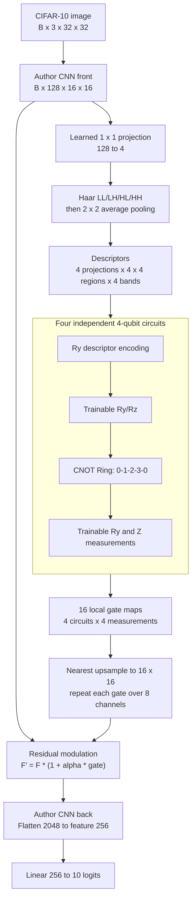

# V234 Projected-Wavelet Replacement

This model removes the author's raw-pixel DQ branch. The only quantum module is
the projected-wavelet Ring attention inside the CNN trunk.

Removed components:

- 460 raw RGB pixel pairs
- ten author class-specific two-qubit circuits
- 920 fuzzy memberships and log-domain aggregation
- author `Linear(10, 256)` fuzzy projection
- feature addition between the CNN and author DQ branches

The Ring, no-entanglement, and classical matched variants each add exactly 576
parameters over the pure CNN control: 512 projection weights, 48 interaction
parameters, and 16 bounded modulation parameters.
