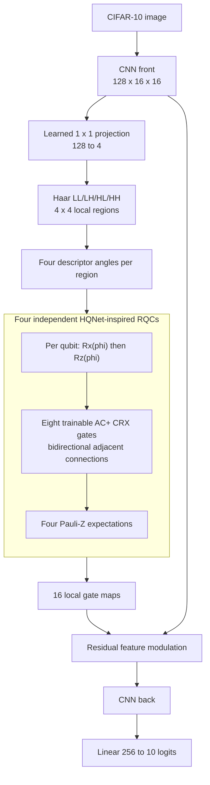

# V235 HQNet-Inspired RQC Replacement

V235 preserves the V234 replacement integration and changes only the local
four-qubit circuit. The author's raw-pixel DQ branch remains removed.



AC+ connections:

```text
0->1, 0->3, 1->0, 1->2, 2->1, 2->3, 3->2, 3->0
```

Controls:

- `quantum_local_rx`: replace every CRX by an RX on the target qubit while
  retaining the same trainable angles.
- `classical_matched`: use the same 32 parameters as directed cross-band
  interactions.
- `cnn_control`: remove the complete projected-wavelet module.

Each non-CNN variant adds 560 parameters: 512 projection weights, 32
interaction angles or weights, and 16 bounded modulation parameters. The RQC
is reimplemented with the existing batched PyTorch statevector simulator; it
does not add a TorchQuantum dependency.
